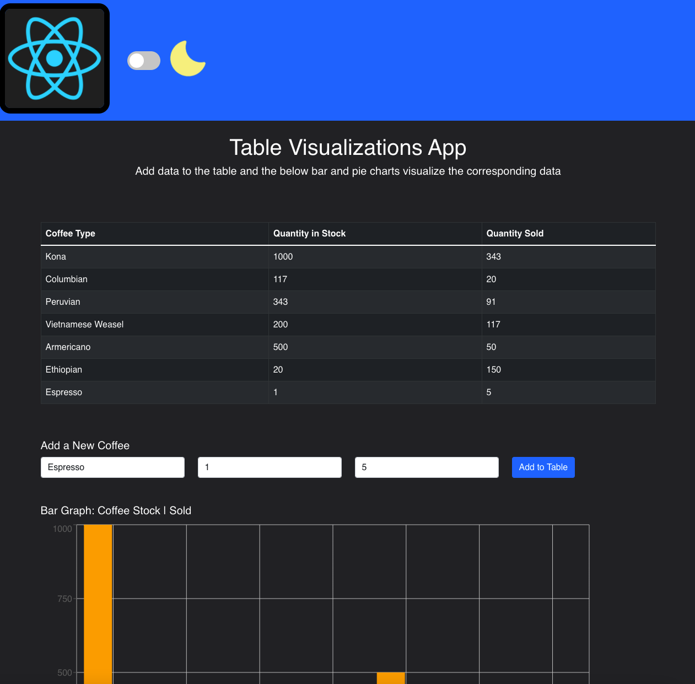
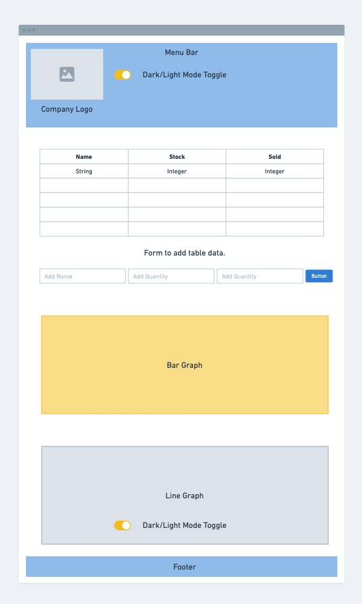

# Gauged Solutions: Option 2

## Description:
React app table visualizations.

## Deployment Link:
https://data-graph-ig.surge.sh/

## Screenshots:

#### Wireframe:

## Trello Board:
https://trello.com/b/7bfE2IxS/gauged-solutions-option-2

## Technologies Used:
#### Front-End:
- HTML5
- CSS3
- React.js
- Bootstrap
- Recharts (npm)
- Surge
#### Version Control:
- Git
- GitHub
#### Editor:
- VS Code Editor

## Resources and References:
#### Development Environment:
// https://reactjs.org/docs/create-a-new-react-app.html
// https://www.npmjs.com/package/react-router-dom
// https://www.npmjs.com/package/react-minimal-pie-chart
// https://www.npmjs.com/package/chart.js
// https://react-bootstrap.netlify.app/getting-started/introduction/
// https://www.npmjs.com/package/recharts
#### Information References:
// https://recharts.org/en-US/api/LineChart#### 
// https://stackoverflow.com/questions/38486660/how-to-add-a-classname-id-to-react-bootstrap-component
#### Images References / Credits:
// https://www.w3schools.com/howto/howto_css_switch.asp
// https://thenounproject.com/icon/dark-mode-4300955/
// https://thenounproject.com/icon/brightness-4140598/
#### Sounds References / Credits:
#### Fonts / Credits: